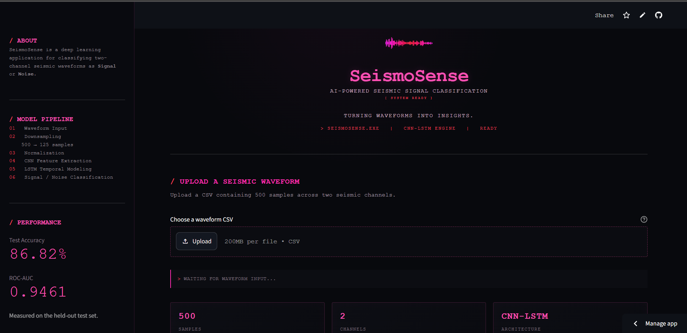
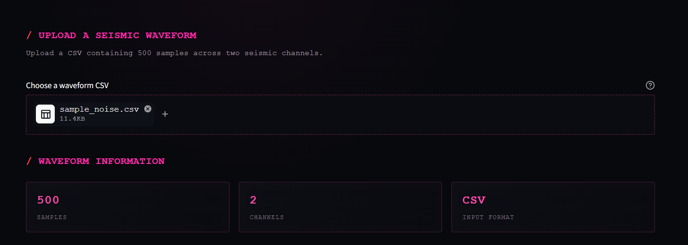
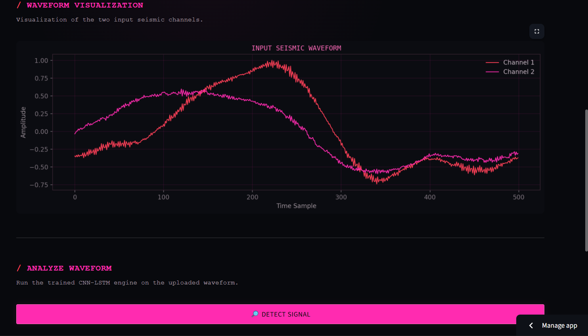
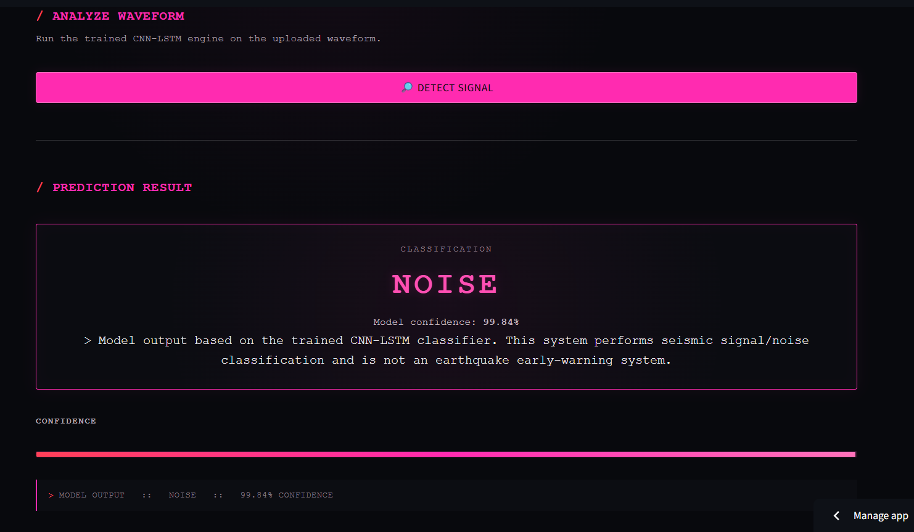
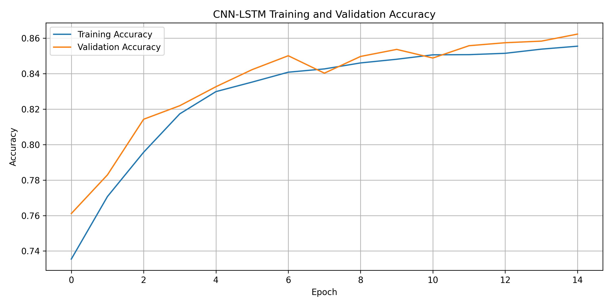
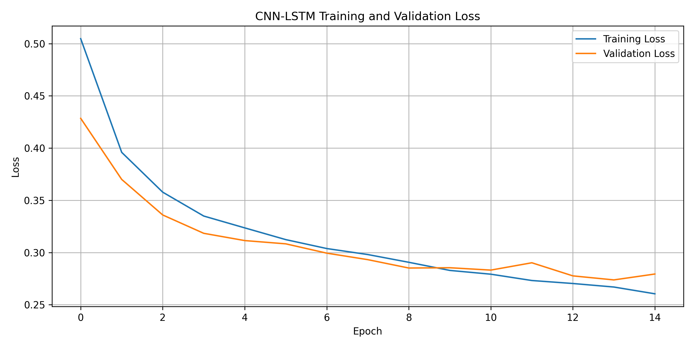
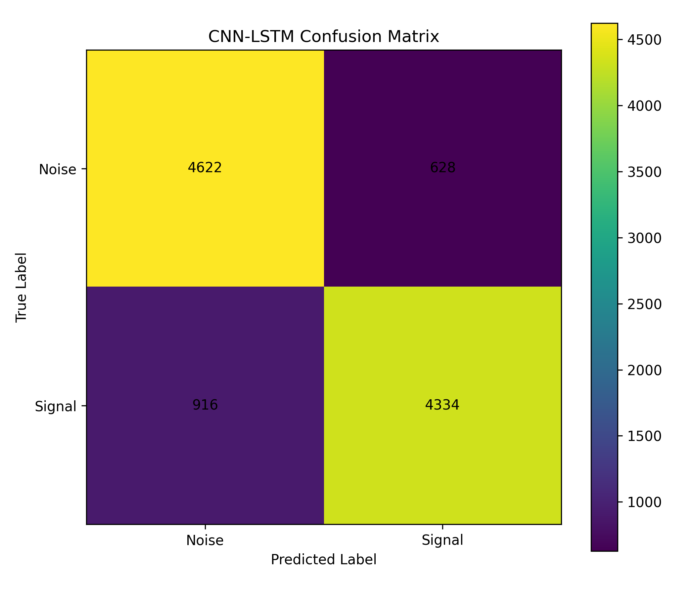
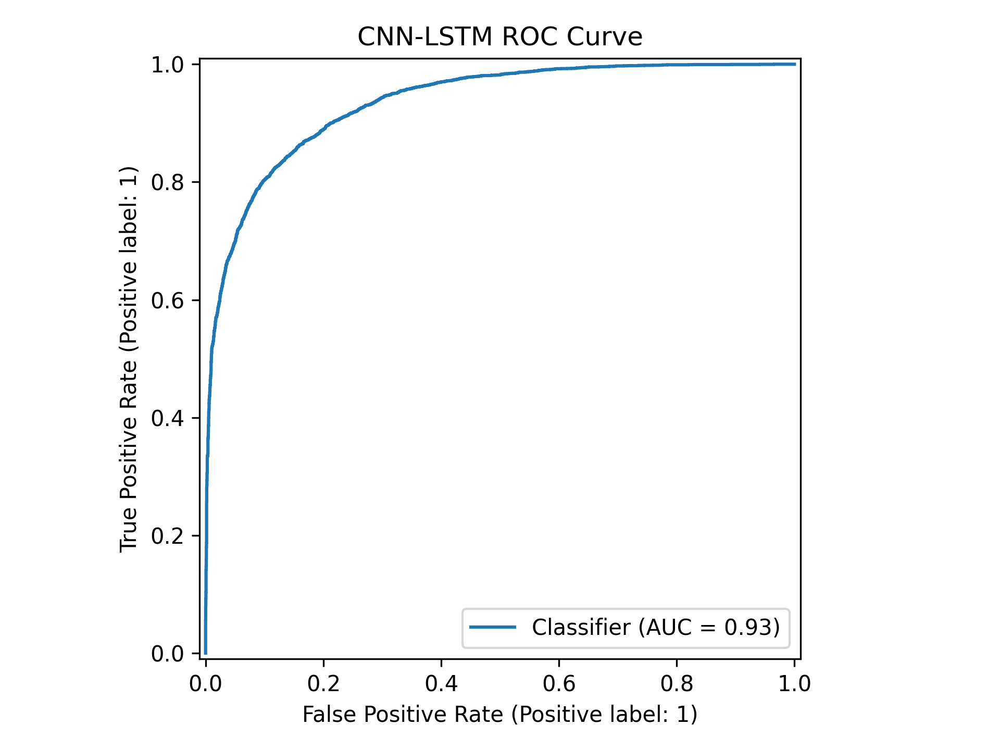

# SeismoSense — CNN-LSTM Seismic Signal Classification

[](https://seismosense-ai.streamlit.app/)

> An AI-powered seismic waveform classification system that uses a hybrid CNN-LSTM neural network to distinguish seismic signals from noise.

🌐 **Live Application:** https://seismosense-ai.streamlit.app/

---

## Overview

**SeismoSense** is a deep learning-based seismic signal classification system designed to identify whether a multichannel seismic waveform contains a meaningful seismic signal or represents noise.

The project combines a **1D Convolutional Neural Network (CNN)** for extracting local waveform features with a **Long Short-Term Memory (LSTM)** network for learning temporal dependencies within seismic data.

A Streamlit web application provides an interactive interface where users can upload seismic waveform CSV files, visualize the input signals, and obtain model predictions with confidence scores.

> **Note:** SeismoSense performs seismic signal/noise classification. It is not an earthquake prediction, forecasting, or early-warning system.

---

## Live Demo

Try SeismoSense here:

**https://seismosense-ai.streamlit.app/**

The application allows you to:

- Upload two-channel seismic waveform data
- Inspect waveform metadata
- Visualize both seismic channels
- Run CNN-LSTM inference
- View Signal/Noise classification
- Inspect model confidence

Sample input files are included in this repository for testing.

---

## 🖥️ Application Preview






## Key Features

- Hybrid **CNN-LSTM deep learning architecture**
- Binary seismic **Signal vs Noise** classification
- Two-channel waveform processing
- Task-level train/validation/test splitting to reduce data leakage
- Training-set-only normalization
- Interactive waveform visualization
- Prediction confidence display
- Streamlit-based web interface
- Public cloud deployment
- Sample seismic files for testing

---

## System Architecture

The inference pipeline used by SeismoSense is:

```text
Seismic Waveform
      │
      ▼
Two-Channel Input
(500 × 2)
      │
      ▼
Downsampling
(125 × 2)
      │
      ▼
Normalization
      │
      ▼
Conv1D
32 filters, kernel size 7
      │
      ▼
MaxPooling1D
pool size 4
      │
      ▼
Dropout
0.2
      │
      ▼
LSTM
32 units
      │
      ▼
Dropout
0.2
      │
      ▼
Dense + Sigmoid
      │
      ▼
Signal / Noise
```

The **CNN** learns local waveform characteristics, while the **LSTM** captures temporal relationships in the extracted sequence features.

---

## Dataset

The model was developed using the **SeisTask** seismic waveform dataset.

The processed dataset contains:

- **102,060 waveform samples**
- **2 waveform channels**
- **500 time samples per waveform**
- Balanced binary labels:
  - 51,030 Signal samples
  - 51,030 Noise samples

Original waveform shape:

```text
(102060, 2, 500)
```

The data is transposed before model training:

```text
(102060, 500, 2)
```

The waveforms are then downsampled by a factor of four:

```text
(102060, 125, 2)
```

The large raw HDF5 dataset is intentionally excluded from this repository.

---

## Data Preprocessing

The preprocessing pipeline performs the following operations:

### 1. Load waveform data

Waveforms are loaded from the SeisTask HDF5 dataset.

### 2. Convert datatype

```python
X = X.astype(np.float32)
```

This reduces memory usage during model training.

### 3. Transpose waveform dimensions

```python
X = np.transpose(X, (0, 2, 1))
```

The resulting representation follows:

```text
(samples, timesteps, channels)
```

which is expected by Keras `Conv1D` layers.

### 4. Downsample

```python
X = X[:, ::4, :]
```

This reduces each waveform from 500 to 125 timesteps, significantly reducing training cost.

### 5. Normalize

Normalization statistics are calculated **only from the training set**:

```python
mean = X_train.mean(axis=(0, 1), keepdims=True)
std = X_train.std(axis=(0, 1), keepdims=True)
```

The same statistics are subsequently applied to validation, test, and inference data.

This prevents information from the validation or test sets from leaking into training.

---

## Train / Validation / Test Split

The dataset was separated using **task-level splitting** rather than randomly splitting individual waveform rows.

Final dataset sizes:

| Dataset | Samples |
|---|---:|
| Training | 81,480 |
| Validation | 10,080 |
| Test | 10,500 |

Task-level separation helps reduce leakage between related waveform samples belonging to the same underlying task.

---

## CNN-LSTM Model

The model architecture is implemented using TensorFlow/Keras.

```python
model = Sequential([
    Input(shape=input_shape),

    Conv1D(
        filters=32,
        kernel_size=7,
        activation="relu"
    ),

    MaxPooling1D(pool_size=4),

    Dropout(0.2),

    LSTM(
        32,
        return_sequences=False
    ),

    Dropout(0.2),

    Dense(
        1,
        activation="sigmoid"
    )
])
```

The model is compiled using:

```python
optimizer="adam"
loss="binary_crossentropy"
metrics=["accuracy"]
```

---

## Model Performance

The final CNN-LSTM model was evaluated on a held-out test set containing **10,500 samples**.

### Overall Results

| Metric | Result |
|---|---:|
| Test Accuracy | **86.82%** |
| ROC-AUC | **0.9461** |
| Test Samples | **10,500** |

### Classification Report

| Class | Precision | Recall | F1-Score | Support |
|---|---:|---:|---:|---:|
| Noise | 0.85 | 0.89 | 0.87 | 5,250 |
| Signal | 0.89 | 0.84 | 0.86 | 5,250 |
| **Accuracy** | | | **0.87** | **10,500** |
| Macro Avg | 0.87 | 0.87 | 0.87 | 10,500 |
| Weighted Avg | 0.87 | 0.87 | 0.87 | 10,500 |

### Confusion Matrix

```text
                  Predicted
                 Noise   Signal

Actual Noise      4689     561
Actual Signal      823    4427
```

The ROC-AUC score of **0.9461** indicates strong separation between the Signal and Noise classes on the held-out test set.

---

## Model Evaluation Visualizations

Training and evaluation plots generated during experimentation are available in the `plots/` directory.

### Training Accuracy



### Training Loss



### Confusion Matrix



### ROC Curve



---

## Web Application

The trained model is integrated into an interactive **Streamlit** application.

The application performs the following inference pipeline:

```text
Upload CSV
    ↓
Validate waveform
    ↓
Downsample
    ↓
Normalize
    ↓
CNN feature extraction
    ↓
LSTM temporal analysis
    ↓
Sigmoid probability
    ↓
Signal / Noise prediction
```

A probability threshold of `0.5` is used for binary classification.

---

## Input Format

SeismoSense expects a CSV containing a two-channel waveform with approximately the following structure:

```csv
channel_1,channel_2
0.012,-0.021
0.018,-0.016
0.025,-0.009
...
```

The expected waveform contains:

```text
500 samples × 2 channels
```

Example files are provided:

```text
sample_signal.csv
sample_noise.csv
```

These can be uploaded directly to the deployed application.

---

## Project Structure

```text
CNN-LSTM-Seismic-Signal-Classification/
│
├── app.py
├── predict.py
├── preprocessing.py
├── train.py
├── evaluate.py
├── requirements.txt
├── .gitignore
│
├── model/
│   └── cnn_lstm_model.py
│
├── models/
│   ├── earthquake_model_v2.keras
│   ├── normalization.npz
│   └── training_history_v2.csv
│
├── plots/
│   ├── training_accuracy.png
│   ├── training_loss.png
│   ├── confusion_matrix.png
│   └── roc_curve.png
│
├── assets/
│   └── ...
│
├── sample_signal.csv
├── sample_noise.csv
│
└── test/
```

The raw SeisTask HDF5 dataset is excluded from GitHub because of its size.

---

## Running Locally

### 1. Clone the repository

```bash
git clone https://github.com/jethasriM/CNN-LSTM-Seismic-Signal-Classification.git
```

Move into the project:

```bash
cd CNN-LSTM-Seismic-Signal-Classification
```

### 2. Create a virtual environment

Windows:

```bash
python -m venv .venv
.venv\Scripts\activate
```

macOS/Linux:

```bash
python3 -m venv .venv
source .venv/bin/activate
```

### 3. Install dependencies

```bash
pip install -r requirements.txt
```

### 4. Start SeismoSense

```bash
streamlit run app.py
```

Streamlit will provide a local URL for accessing the application.

---

## Technologies Used

**Machine Learning**

- Python
- TensorFlow
- Keras
- NumPy
- Pandas
- Scikit-learn
- h5py

**Visualization**

- Matplotlib

**Application**

- Streamlit

**Model Architecture**

- Conv1D
- Max Pooling
- LSTM
- Dropout
- Sigmoid binary classifier

**Deployment**

- GitHub
- Streamlit Community Cloud

---

## Model Artifacts

The `models/` directory contains the artifacts required for inference:

```text
earthquake_model_v2.keras
normalization.npz
training_history_v2.csv
```

`earthquake_model_v2.keras` contains the trained CNN-LSTM model.

`normalization.npz` stores the channel-wise training mean and standard deviation required to reproduce the preprocessing used during training.

`training_history_v2.csv` stores training metrics for analysis and visualization and is not required for inference.

---

## Limitations

SeismoSense is an experimental machine learning project and has several important limitations.

- The model performs binary Signal/Noise classification only.
- Predictions depend on the characteristics and distribution of the training dataset.
- The current application expects a fixed two-channel waveform format.
- A fixed `0.5` classification threshold is currently used.
- The system does not estimate earthquake magnitude, epicenter, depth, or arrival time.
- The system does not predict future earthquakes.
- It should not be interpreted as an operational earthquake early-warning system.

---

## Future Improvements

Potential improvements include:

- Threshold optimization using validation data
- More extensive hyperparameter tuning
- Additional convolutional layers for richer feature extraction
- Attention-based temporal modeling
- Transformer-based seismic sequence models
- Support for variable-length waveforms
- Real-time seismic stream processing
- Multi-class seismic event classification
- Model explainability and feature visualization
- Evaluation on additional independent seismic datasets
- API-based inference for integration with external systems

---

## Deployment

The application is deployed using **Streamlit Community Cloud**.

🌐 **Live Demo**

https://seismosense-ai.streamlit.app/

The deployed application loads the trained CNN-LSTM model and normalization parameters directly from the repository.

---

## Disclaimer

SeismoSense was developed as a machine learning and research-oriented project for seismic waveform classification.

The predictions generated by the application should **not** be used for emergency response, earthquake forecasting, public safety decisions, or operational seismic monitoring.

---

## Author

**Muvvala Jethasri**

Computer Science & Engineering — Artificial Intelligence and Machine Learning

Interested in building practical AI/ML systems spanning deep learning, computer vision, time-series modeling, and intelligent applications.

---

## License

This project is intended for educational and research purposes.

Dataset usage remains subject to the terms and licensing conditions of the original dataset provider.